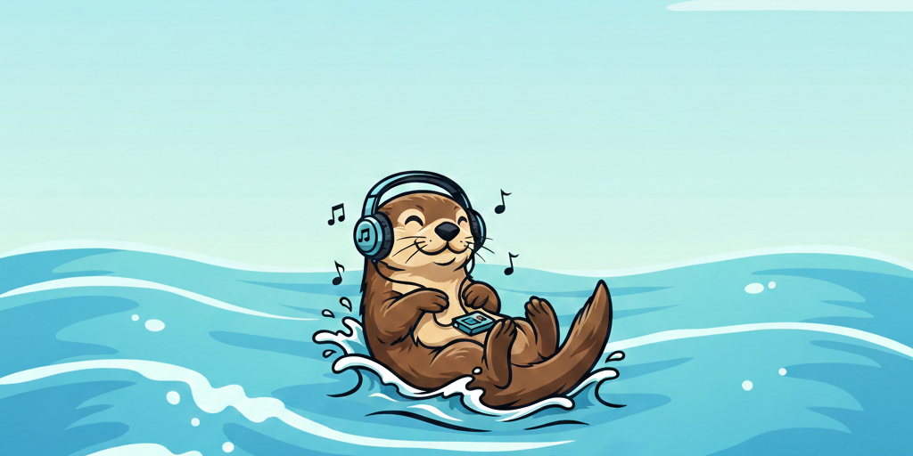

<p align="center">
  
</p>

<h1 align="center">MusicOtter</h1>

<p align="center">
  <em>Floating along, listening to tunes. &mdash; Discord music bot built by TunnelRat (a.k.a. "Krozz").</em>
  <br />
  <em>Bot was made with TypeScript, Sapphire Framework, and yt-dlp.</em>
</p>

<p align="center">
  <a href="https://discord.js.org/"></a>
  <a href="https://www.sapphirejs.dev/"></a>
  <a href="https://www.typescriptlang.org/"></a>
  <a href="https://nodejs.org/"></a>
  <a href="https://unlicense.org/"></a>
</p>

<br />

## Features

| | Feature | Description |
|---|---------|-------------|
| :musical_note: | **Multi-Source Playback** | YouTube (URLs, playlists, search), Spotify (auto-resolves to YouTube), and SoundCloud |
| :clipboard: | **Full Queue Management** | Add, skip, shuffle, loop (track/queue), clear, move, and jump to any position |
| :fast_forward: | **Seek Support** | Seek forward, backward, or to an absolute position in the current track |
| :shield: | **Per-Server State** | Independent queues, volume, DJ roles, and settings for every server |
| :lock: | **DJ Role System** | Server admins can assign a DJ role to restrict sensitive commands |
| :tv: | **Now Playing Embeds** | Rich embeds with track info, progress bar, volume, and loop indicator |
| :books: | **Paginated Queue** | Interactive prev/next buttons for browsing large queues |
| :wave: | **Auto-Disconnect** | Leaves after 30s with no listeners or 10s with an empty queue |
| :mag: | **Interactive Search** | Browse the top 5 YouTube or SoundCloud results and pick one with buttons |
| :loud_sound: | **Volume Control** | Adjustable from 0 to 150% (default: 70%) |
| :link: | **Channel Binding** | Bind the bot to a specific text channel (`/settc`) or voice channel (`/setvc`) |
| :microphone: | **Lyrics** | Fetch song lyrics from Genius, defaults to the currently playing track |
| :radio: | **Radio Stations** | Pre-configured playlist stations you can browse and play instantly |
| :zap: | **29 Slash Commands** | Every command registered as a Discord slash command |

---

## Commands

<details>
<summary><strong>:musical_note: Playback</strong> (11 commands)</summary>

| Command | Description |
|---------|-------------|
| `/play <query>` | Play a song or add it to the queue (URL or search term) |
| `/search <query>` | Search YouTube and choose from the top 5 results |
| `/scsearch <query>` | Search SoundCloud and choose from the top 5 results |
| `/playnext <query>` | Add a song to the front of the queue |
| `/pause` | Pause the current track |
| `/resume` | Resume playback |
| `/skip` | Skip the current track |
| `/seek <time>` | Seek to a position in the current track (`+`, `-`, or absolute) |
| `/skipto <position>` | Jump to a specific queue position :lock: |
| `/stop` | Stop playback, clear the queue, and disconnect :lock: |
| `/radiostations` | Browse and play pre-configured radio stations |

</details>

<details>
<summary><strong>:clipboard: Queue</strong> (6 commands)</summary>

| Command | Description |
|---------|-------------|
| `/queue` | View the current queue with pagination |
| `/nowplaying` | Show the currently playing track with progress bar |
| `/loop [mode]` | Cycle or set loop mode (off / track / queue) |
| `/shuffle` | Shuffle the upcoming queue |
| `/clearqueue` | Clear all upcoming tracks :lock: |
| `/movetrack <from> <to>` | Move a track to a different queue position :lock: |

</details>

<details>
<summary><strong>:gear: Settings & Admin</strong> (5 commands)</summary>

| Command | Description | Requires |
|---------|-------------|----------|
| `/volume [level]` | View or set volume (0-150) | :lock: DJ |
| `/setdj [role]` | View or set the DJ role | Manage Server |
| `/settc` | Bind now-playing messages to the current channel | :lock: DJ |
| `/setvc [channel]` | Restrict the bot to a voice channel (omit to clear) | :lock: DJ |
| `/forceremove <user>` | Remove all tracks queued by a user | :lock: DJ |

</details>

<details>
<summary><strong>:information_source: Info</strong> (4 commands)</summary>

| Command | Description |
|---------|-------------|
| `/lyrics [song]` | Show lyrics for a song (defaults to currently playing) |
| `/help` | List all commands (sent via DM) |
| `/about` | Show bot info, uptime, and stats |
| `/ping` | Check bot latency |

</details>

<details>
<summary><strong>:wrench: Owner Only</strong> (3 commands)</summary>

| Command | Description |
|---------|-------------|
| `/debug` | Show runtime & server debug info (memory, tracks played, guilds) |
| `/evaluate` | View the last 30 lines of bot logs |
| `/invite` | Get the bot invite link |

</details>

> :lock: = Requires DJ role or Manage Server permission. If no DJ role is set, all users can use these commands.

---

## Quick Start

```bash
# 1. Clone & install
git clone https://github.com/kurzickkrozz/musicotter.git
cd musicotter
npm install

# 2. Configure
cp .env.example .env
# Edit .env and add your DISCORD_TOKEN

# 3. Build & run
npm run build
npm start
```

> **Prerequisite:** [yt-dlp](https://github.com/yt-dlp/yt-dlp) must be installed and in your PATH. See [installation details](#install-yt-dlp) below.

---

## Prerequisites

- [Node.js](https://nodejs.org/) v18 or higher
- [yt-dlp](https://github.com/yt-dlp/yt-dlp) installed and available in your system PATH
- A [Discord bot application](https://discord.com/developers/applications) with a bot token

### Required Discord Bot Permissions

When inviting the bot to your server, ensure it has:

| Permission | Scope |
|------------|-------|
| Send Messages | Text |
| Embed Links | Text |
| Connect | Voice |
| Speak | Voice |
| Use Voice Activity | Voice |

### Required Gateway Intents

Enable in the Discord Developer Portal under **Bot > Privileged Gateway Intents**:

- **Message Content Intent**

---

## Installation

### Environment Variables

Copy `.env.example` to `.env` and fill in your bot token:

```env
# Required: Your Discord bot token
DISCORD_TOKEN=your_bot_token_here

# Optional: Restrict command registration to a single guild for development
# Commands register instantly to this guild instead of globally (global takes up to 1 hour)
DEV_GUILD_ID=

# Environment: "production" or "development"
NODE_ENV=production
```

### Install yt-dlp

musicotter uses [yt-dlp](https://github.com/yt-dlp/yt-dlp) for YouTube audio streaming, search, and metadata.

<details>
<summary><strong>Windows</strong></summary>

```bash
winget install yt-dlp
```

</details>

<details>
<summary><strong>macOS</strong></summary>

```bash
brew install yt-dlp
```

</details>

<details>
<summary><strong>Linux</strong></summary>

```bash
sudo curl -L https://github.com/yt-dlp/yt-dlp/releases/latest/download/yt-dlp -o /usr/local/bin/yt-dlp
sudo chmod a+rx /usr/local/bin/yt-dlp
```

</details>

Verify: `yt-dlp --version`

### Optional: YouTube Cookies

If you need to play age-restricted or region-locked YouTube content, place a `cookies.txt` file (Netscape format) in the project root. The bot will automatically detect and use it with yt-dlp.

---

## Development

| Script | Description |
|--------|-------------|
| `npm run build` | Compile TypeScript to JavaScript |
| `npm start` | Start the bot |
| `npm run dev` | Build and start in one command |
| `npm run watch:start` | Watch for changes and auto-restart |
| `npm run format` | Format source code with Prettier |

> **Tip:** Set `DEV_GUILD_ID` in `.env` for instant slash command registration during development (global registration can take up to 1 hour).

---

## Architecture

### Audio Pipeline

```
/play "query"
  |
  v
deferReply() --> getOrCreate(guild) --> connect(voice channel)
  |
  v
AudioSourceResolver.resolve(query) --> Queue.enqueue(track)
  |
  v
GuildMusicManager.playNext() --> yt-dlp spawns audio stream
  |
  v
createAudioResource({ inlineVolume }) --> AudioPlayer.play()
  |
  v
Audio plays in voice channel
  |
  +--[Track ends]--> AudioPlayerStatus.Idle --> playNext() --> [repeat]
  |
  +--[Queue empty]--> 10s idle timer --> auto-disconnect
```

### Source Resolution

| Input | How It's Resolved |
|-------|-------------------|
| YouTube URL | Metadata and streaming via yt-dlp |
| YouTube Playlist | All tracks extracted via play-dl and queued |
| Spotify URL | Track metadata via oEmbed API, resolved to YouTube via yt-dlp search |
| SoundCloud URL | Direct streaming via play-dl |
| Search term | YouTube search via yt-dlp, plays first result |

### Seek Pipeline

```
/seek "1:30"
  |
  v
Parse time (absolute, +relative, -relative) --> calculate target seconds
  |
  v
yt-dlp --get-url --> direct audio URL
  |
  v
ffmpeg -ss <seconds> -i <url> --> piped audio stream
  |
  v
createAudioResource(stream) --> AudioPlayer.play() --> playback resumes at new position
```

### Per-Server Isolation

Each server gets its own `GuildMusicManager` instance with independent:
- Voice connection and audio player
- Track queue with loop/shuffle state
- Volume setting
- DJ role configuration
- Bound text and voice channels

---

## Project Structure

```
musicotter/
├── src/
│   ├── index.ts                        # Entry point
│   ├── commands/                        # All 29 slash commands
│   │   ├── play.ts          playnext.ts       search.ts        scsearch.ts
│   │   ├── pause.ts         resume.ts         skip.ts          seek.ts
│   │   ├── skipto.ts        stop.ts           queue.ts
│   │   ├── clearqueue.ts    nowplaying.ts     loop.ts
│   │   ├── shuffle.ts       volume.ts         forceremove.ts
│   │   ├── settc.ts         setvc.ts          setdj.ts
│   │   ├── help.ts          about.ts          ping.ts          lyrics.ts
│   │   ├── debug.ts         evaluate.ts       movetrack.ts     invite.ts
│   │   └── radiostations.ts
│   ├── interaction-handlers/
│   │   ├── queuePagination.ts          # Prev/next buttons for /queue
│   │   ├── searchSelection.ts          # YouTube search result buttons
│   │   ├── scSearchSelection.ts       # SoundCloud search result buttons
│   │   └── stationSelection.ts        # Radio station selection buttons
│   ├── lib/
│   │   ├── setup.ts                    # Plugin registration & container setup
│   │   ├── constants.ts                # Branding & paths
│   │   ├── types.ts                    # Track, LoopMode, AudioSource
│   │   ├── utils.ts                    # Formatting helpers & embed factories
│   │   ├── Queue.ts                    # Array-backed queue with loop/shuffle
│   │   ├── AudioSourceResolver.ts      # Source detection, resolution & streaming
│   │   ├── GuildMusicManager.ts        # Per-guild player, connection & queue
│   │   ├── MusicManagerStore.ts        # Guild manager collection & stats
│   │   ├── LogBuffer.ts               # In-memory ring buffer for /evaluate
│   │   └── stations.ts               # Radio station playlist config
│   ├── listeners/
│   │   ├── ready.ts                    # Startup banner & presence
│   │   ├── voiceStateUpdate.ts         # Auto-disconnect on empty channel
│   │   └── commands/chatInputCommands/
│   │       ├── chatInputCommandDenied.ts  # Ephemeral precondition errors
│   │       └── chatInputCommandSuccess.ts # Command usage logging
│   └── preconditions/
│       ├── BoundTextChannel.ts        # Enforce text channel binding
│       ├── InVoiceChannel.ts           # User must be in a voice channel
│       └── DJOnly.ts                   # DJ role or Manage Server required
├── .env.example
├── .gitignore
├── .prettierignore
├── .sapphirerc.yml
├── banner.png
├── logo.png
├── package.json
└── tsconfig.json
```

---

## Tech Stack

| Technology | Purpose |
|------------|---------|
| [Discord.js v14](https://discord.js.org/) | Discord API client |
| [Sapphire Framework](https://www.sapphirejs.dev/) | Command framework with preconditions & decorators |
| [@discordjs/voice](https://discord.js.org/docs/packages/voice/main) | Voice connection & audio playback |
| [yt-dlp](https://github.com/yt-dlp/yt-dlp) | YouTube search, metadata & audio streaming |
| [youtube-dl-exec](https://github.com/microlinkhq/youtube-dl-exec) | Node.js wrapper for yt-dlp |
| [ffmpeg-static](https://github.com/eugeneware/ffmpeg-static) | Bundled FFmpeg binary for seek & audio processing |
| [play-dl](https://github.com/play-dl/play-dl) | URL validation, SoundCloud streaming & playlist extraction |
| [genius-lyrics](https://github.com/Lebyy/genius-lyrics) | Song lyrics from Genius |
| [@snazzah/davey](https://github.com/Snazzah/davey) | Discord DAVE voice encryption protocol support |
| [TypeScript](https://www.typescriptlang.org/) | Type-safe development |

---

## Troubleshooting

<details>
<summary><strong>Bot joins voice but no audio plays</strong></summary>

- Ensure `yt-dlp` is installed and available in your system PATH
- Run `yt-dlp --version` to verify
- Check the bot has **Speak** and **Connect** permissions in the voice channel

</details>

<details>
<summary><strong>Commands not appearing in Discord</strong></summary>

- Global command registration can take up to 1 hour
- For instant registration, set `DEV_GUILD_ID` in `.env` to your test server ID
- Restart the bot after changes

</details>

<details>
<summary><strong>"Cannot utilize the DAVE protocol" error</strong></summary>

- This is resolved automatically — the bot includes `@snazzah/davey` for Discord's voice encryption protocol

</details>

<details>
<summary><strong>Bot crashes on skip/stop</strong></summary>

- Ensure you're running the latest version with proper yt-dlp process lifecycle handling

</details>

<details>
<summary><strong>Spotify links not working</strong></summary>

- Spotify tracks are resolved by searching YouTube for the track title and artist via the public oEmbed API (no Spotify credentials needed)
- Spotify playlists and albums are not supported — only individual track links

</details>

<details>
<summary><strong>Now-playing embeds not appearing</strong></summary>

- Ensure the bot has **Send Messages** and **Embed Links** permissions in the bound text channel
- Use `/settc` in the desired channel to rebind

</details>

<details>
<summary><strong>Age-restricted YouTube videos not playing</strong></summary>

- Place a `cookies.txt` file (Netscape format) in the project root
- Export cookies from a browser where you are logged into YouTube
- The bot will automatically pass them to yt-dlp

</details>

---

## License

This project is released under the [Unlicense](https://unlicense.org/). You are free to use, modify, and distribute this software without restriction.

---

<p align="center">
  Developed by <strong>TunnelRat</strong>
</p>
